
# **Automated AWS Model Creator Overview**

CITU\_DevTeam (Team Intellisys) are the developers that are responsible for the project, **Automated AWS Model Creator**, as a compliance for the course, CS498-F1, which is handled by the Dean of the College of Computer Studies in Cebu Institute of Technology - University. The developers intend to pursue their study, namely, **“Evaluating the performance of YOLOv5 online training for laser soldering condition inspection”**, which was requested by the Cebu Mitsumi Inc. that the researchers need to accomplish before proceeding with the development of the project.

To review the alignment of Mitsumi’s technical request with the researcher’s project, the following objectives are:

- The software should be available for the **Windows 10/11 OS**.
- The software should be in **Windows Form Application**, specifically in .NET Framework version 4.8.
- The Windows Form Application should allow users to:
- **Upload the dataset online**.
- **Manually set the training parameters**.
- **Train the model online**.
- The software should use the **YOLOv5** model architecture for training.
- The software should be capable of simultaneous training.
- The software should be able to retrieve the custom trained model in **.ONNX** format.

The succeeding section of this documentation is the complete **prerequisites and setup** that the researchers have provided in order to showcase what is needed and guide before and during using the application.

## **System Architecture**
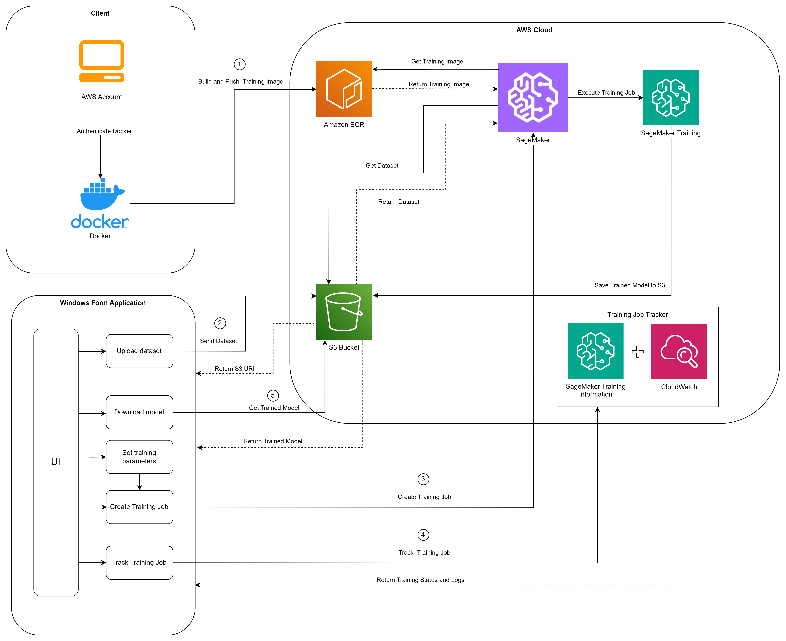

## **User Interface**
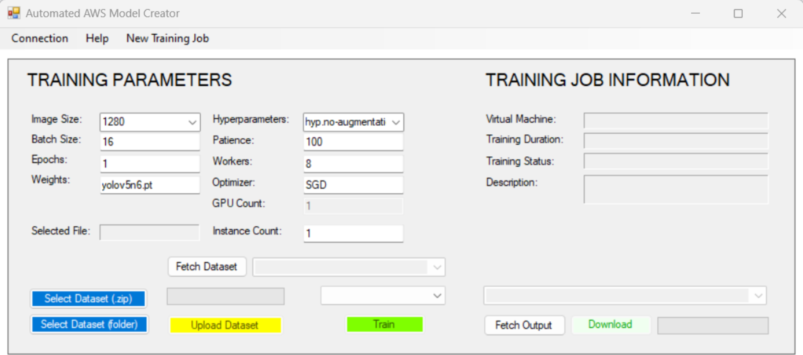

## **How SageMaker Container Works**
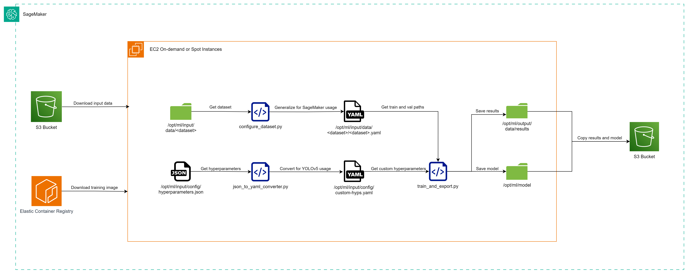

# **Application Prerequisites**

## **Service Quotas**

Service Quotas (formerly known as Service Limits) in Amazon Web Services (AWS) refer to the maximum values for various resources, actions, and items within your AWS account.

The AutomatedAWS-ModelCreator Windows Form Application uses the Amazon SageMaker service, however, it is important to take note that every other computing instance (virtual machines) in AWS always requires a service quota increase of that instance before using it. The amount of training jobs you can simultaneously run is dependent on your applied account-level service quota on that instance.

To increase your applied account-level service quota value, the following steps are:

1. Sign in to the AWS Management Console:
1. Make sure that you are in the correct region (i.e., Asia Pacific - Singapore ap-southeast-1).
1. Go to the AWS Management Console and search for Service Quotas.
2. Select AWS Services in the navigation pane of Service Quotas.
2. Search for Amazon SageMaker in the search tab.
2. Lookup for the quota name “ml.g4dn.xlarge for spot training job usage” or you can select another instance type that is also available for spot training jobs.
2. Select Request increase at account level.
   1. Increase the quota value by one (1) or more.
   1. Proceed to Request after setting the quota value.
2. Wait for a few minutes for the request to be processed.

### **Max instances per Training Job vs. Spot Training Job Usage**

Both are service quotas found in the Amazon SageMaker service, however they are both separate entities.

***Max Instances per Training Job*** quota refers to the maximum number of instances you can use for a single training job in Amazon SageMaker. This can only be used when the training algorithm is capable of utilizing multiple instances through network intercommunication in order to significantly increase the training duration. It is also available to single/multiple GPU instances. However, as of this documentation, training with multiple instances is not yet possible because it is still in development.

***Spot Training Job Usage*** quota, e.g “*ml.g4dn.xlarge for spot training job usage*”, refers to the maximum number of computing instances that you can use simultaneously in your AWS account.

### **New Account Limitations and Request Approval Requirement**

New accounts, by default, have their service quotas at zero (0). This case applies to Amazon SageMakers spot instances. Increasing the limit by one (1) will almost be guaranteed to receive approval in just a few minutes.

The main problem for new accounts in AWS is that when requesting a quota increase value that is more than one (1), it will not immediately receive approval. Depending on the quality and specification of that computing instance, AWS will return a feedback and ask for the customer’s business use case and minimum quota value before approving the request. In that duration, customers are required to submit their response with their intentions of their usage in a clear manner before the request expires.

Despite that, it is possible to gradually increase the quota value and that it is recommended by AWS that users should first utilize their current resources before requesting for another. In addition to that, AWS can also automatically increase your quota value if there was any proven usage or utilization of that resource/s without asking for any customer action.

### **Maximum number of instance per spot training job**

The “Maximum number of instances per spot training job” quota in Amazon SageMaker refers to the limit on the number of instances that can be used simultaneously for a single spot training job

This quota is important because it helps manage the resources used by your Spot Training Jobs. By setting a limit on the number of instances, AWS ensures fair usage of resources among all users. It also helps you control your costs, as the number of instances used can directly impact the cost of your Spot Training Job.

When you set up your Spot Training Job in SageMaker, AWS automatically applies this quota. If you need to increase this quota, you can request a quota increase from AWS. Keep in mind that approval for quota increases is at AWS’s discretion and is based on your account standing and usage history.

### **Number of instances across all spot training jobs**

The “Number of instances across all spot training jobs” quota refers to the maximum number of instances that can be used across all your Spot Training Jobs at any given time.

By setting a maximum limit on the number of instances, AWS ensures fair allocation of resources among all users. This prevents any single user from monopolizing the available Spot Instances, promoting balanced resource usage. This quota helps you control the costs associated with your Spot Training Jobs. Since the cost is directly related to the number of instances used, setting a limit can prevent unexpected expenses and keep your budget in check.

## **IAM Role with Amazon SageMaker Full Access Requirement**

The application requires an IAM Role, specifically that contains the Amazon SageMaker Full Access policy attached to that role. The purpose of needing this policy would involve allowing the application to gain access to services that are connected and needed by the SageMaker service. The only services connected to SageMaker are Elastic Container Registry (ECR) for storing the training algorithm, Simple Storage Service (S3) for storing the dataset and training output files, and CloudWatch for recording the training logs. Furthermore, users are only required to get the Amazon Resource Names (ARN) of that IAM Role.

To get the Role ARN of an IAM Role with Amazon SageMaker Full Access:

1. Sign in to the AWS Management Console:

   a. Go to the AWS Management Console and search for the IAM (Identity and Access Management) service.

2. Access Your Security Credentials:

   a. In the IAM service, choose Roles under the Access management section of the navigation pane.

3. Select Create role and the AWS service should be the trusted entity type:
1. Choose SageMaker from the list of Services or use cases.
1. Make sure that the SageMaker - Execution is selected and then proceed.
1. The AmazonSageMakerFullAccess AWS managed policy will be automatically attached to the role.
1. Enter a Role name.
1. Finish by clicking on Create role.
4. Select the role that you have created:

   a. Take note or copy the Amazon Resource Name (ARN) associated with this role.

If you do not have access in creating a role, please contact your root account’s administrator that is capable of creating the IAM Role. However, if the role is already created, you may skip the instructions and look for the IAM Role that your administrator has provided then do Step #4.

## **IAM User and User Group Policies**

In AWS, policies determine what actions a user can perform, on which AWS resources, and under what conditions. For the application’s case, the user and the user group must have all the policies mentioned below. These are necessary because the application uses various AWS services to function properly.

Here are the list of required policies as of the application version:

- AmazonEC2ContainerRegistryFullAccess
- AmazonS3FullAccess
- AmazonSageMakerFullAccess
- CloudWatchFullAccess
- IAMCustomAccess
- ServiceQuotaFullAccess

Here are the steps to add the these policies:

1. Sign in to the AWS Management Console and open the IAM console.
1. In the navigation pane, choose Users or Groups depending on whether you want to add the policy to a user or a group.
1. Choose the name of the user or group to which you want to add the policy.
1. Choose the Permissions tab, and then choose Add permissions.
1. Choose Attach existing policies directly.
1. In the search box, type the name of the policy and select the checkbox next to the policy.
1. Choose Review and then Add permissions to confirm.

If you do not have access to creating the policies, please contact your root account’s administrator that is capable of creating the policies to users or user groups.

## **Simple Storage Service (S3) Bucket Requirement**

An S3 Bucket is required to store the dataset to be used for training, training results, and the trained machine learning model. It is ideal that the S3 Bucket should be made before proceeding to the training process of the application. In addition to that, the following instructions will also guide you in manually creating the appropriate folders in the S3 Bucket for the application to access.

To create an S3 Bucket:

1. Sign in to AWS Console:
   1. Log in to your AWS Management Console.
   1. Open the Amazon S3 console by navigating to Amazon S3.
1. Create a New Bucket:
   1. In the navigation pane, click on Buckets.
   1. Choose Create bucket.
1. Configure Bucket Settings:
1. Provide a unique name for your bucket in the Bucket name field.

The bucket name must:

1. Be unique across all existing bucket names in Amazon S3.
1. Be between 3 and 63 characters long.
1. Consist only of lowercase letters, numbers, dots (.), and hyphens (-).
1. Begin and end with a letter or number.
1. When SageMaker connects to an S3 Bucket, it is ideal that the name of the bucket should be formatted as: **sagemaker-region-code-n-account-id**. As of this documentation, the application looks for the S3 Bucket with this name format.
2. Choose the AWS Region where you want the bucket to reside.
1. Select a region close to you to minimize latency and costs.
2. Objects stored in a region never leave that region unless explicitly transferred to another region.
2. Example bucket name in Singapore region (ap-southeast-1) should be updated according to the region that was selected: **sagemaker-ap-southeast-1-123456789101**.
3. Under Object Ownership, choose the ACLs disabled as recommended.
4. Create the bucket.

Additionally when users have finally used the application and have uploaded a dataset, the following folders below will be shown in the bucket under their **users/UserName/** directory of the bucket so that users will not be disturbing any inputs and training jobs of other users.

There should be two(2) folders to be created in this directory and the following are:

1. **custom-uploads**: This folder will be responsible for storing any dataset upload of the user from the application. When the dataset was already used after finishing the training, it will automatically be deleted and will not be found in this directory.
1. **training-jobs**: This folder serves as the resulting directory of all SageMaker training jobs that was executed in the same region. Each training job name will be unique inside this directory, and each of these folders contain the output and model files of the training that can be downloaded directly from the application or manually from the AWS Console Management.

### **Dataset Folder Structure**

It is assumed that users must have a pre-processed dataset with their training and validation images to be used for YOLOv5 training. The application is capable of accepting any structure for as long as the paths for training and validation are indicated in the dataset's configuration file (data.yaml).

## **Setting up Elastic Container Registry**

Amazon Elastic Container Registry (ECR) plays a crucial role in connecting with SageMaker during training jobs because it would not be possible without any algorithm snapshots to be used for any custom datasets. This service only acts as a repository for any algorithms for any purposes and that includes the AI Vision System algorithm, the YOLOv5 model. For each repository in the ECR, it is in the form of an image that takes a snapshot of the algorithm’s environment and the algorithm itself for it to be used and replicated inside any computing instance (virtual machines). This is called containerization technology wherein a certain code is replicable for all machines regardless of package dependencies and version control.

The application is currently using the developers' AWS account ECR repository of the YOLOv5 model image automatically. There is no need for users to set up any further but more details in this section have been covered in the technical documentation of the application.

## **Getting Account Credentials**

The application requires your AWS IAM User account credentials to be able to launch training jobs. Specifically the app requires your account’s **Access Key ID** and **Security Access Key**.

To get your account credentials:

1. Sign in to the AWS Management Console:

   a. Go to the AWS Management Console and search for the IAM (Identity and Access Management) service.

2. Access Your Security Credentials:

   a. In the IAM service, choose My security credentials under the Quick Links section located at the right side of the page or you may click your Account Name located at the top right of the page and select Security Credentials.

3. Create an Access Key:
1. Click on Create Access Key to generate an Access Key ID and Security Access Key.
1. After creating the access key, you must download the **rootkey.csv** file.
1. Select the Download .csv button.
1. These credentials will allow you to authenticate and interact with any AWS services and that includes the Automated-AWS-Model-Creator application.

# **Automated AWS Model Creator Setup**

## **Installation**

Run the **setup.exe** or **AutomatedAWSModelCreator.msi** file and follow the on-screen instructions to install the application in your system. The application will run automatically after a successful installation.

## **Features**

1. **User Login**

   To use the application, you need to link your AWS account. This ensures seamless integration with AWS services.

   1. Login form will be opened after the first run of the application.
   1. Enter your AWS credentials:
      1. Account ID
      1. Access Key ID
      1. Secret Access Key
   1. Specify your AWS region
   1. Enter the Role ARN
   1. Click the Test Connection button to check if the credentials are correct.
   1. Click the Connect after a successful test connection to create the connection and to proceed to the main application interface.

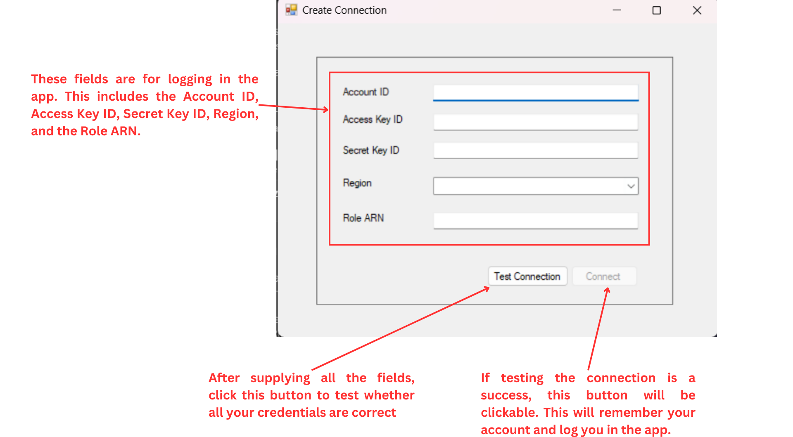

2. **Manage Connection**

   After a successful login, users can manage their connection. Click the Connection tab in the navigation and it will open a drop down with the following items:

   1. Create Connection - Clicking this button will open a new form that will let the user input new login credentials that will override the currently logged in account.
   1. Test Connection - Clicking this button will check the connection of the currently logged in account
   1. Close Connection - Clicking this button will remove the currently logged in account and will direct the user back to the login form where the user will need to input his/her account information to use the application again.

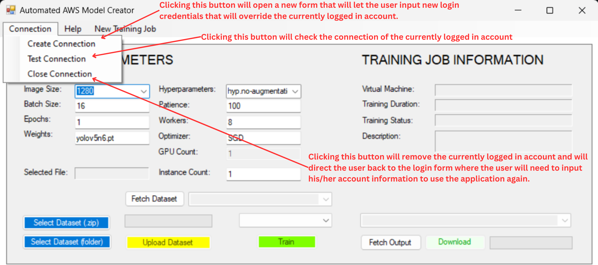

3. **Custom Parameters Input**

   The application lets the users customize the training parameters before initiating a training job.

   Parameters includes the following:

      1. Hyperparameters
      1. Image Size
      1. Patience
      1. Batch Size
      1. Workers
      1. Epochs
      1. Optimizers
      1. Weights
      1. Device

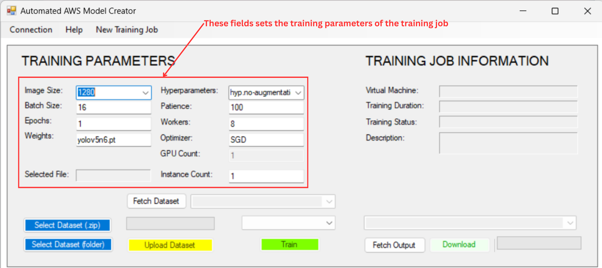

Users can adjust these parameters according to their specific requirements to optimize their training job.

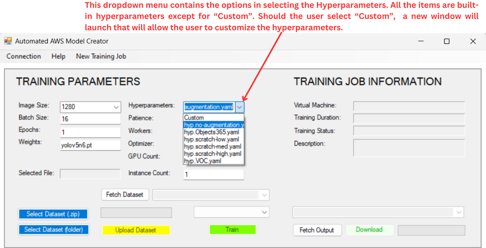

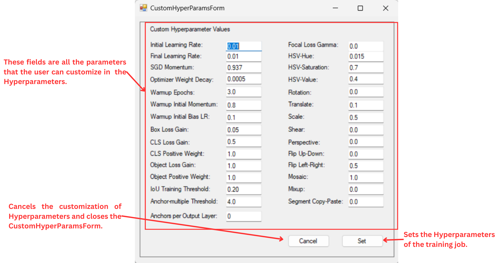

4. **Custom Dataset Upload**

   Users can upload custom dataset to be used in training their models. Uploaded file will be stored in an S3 Bucket inside the **custom-uploads/** directory. Users are given two options in uploading a dataset:

   1. Folder Upload: This will be directly uploaded to the S3 Bucket.
   1. Compressed Folder Upload (zip): This will be decompressed while being uploaded to the S3 Bucket.

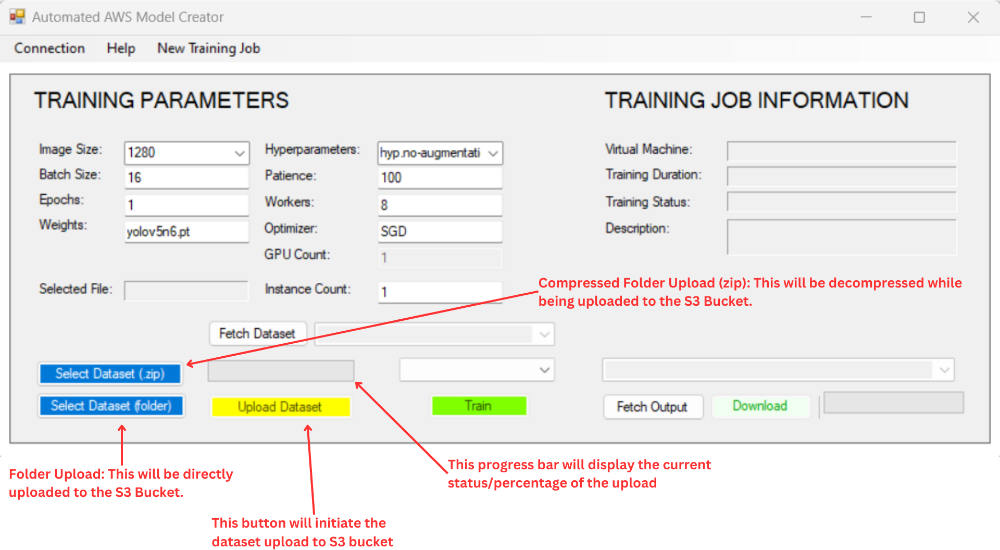

**4.1 Fetching Existing Datasets**

   Users can fetch existing datasets from the **custom-uploads/** directory in the S3 bucket. Users can select a specific dataset to be used in creating a training job.

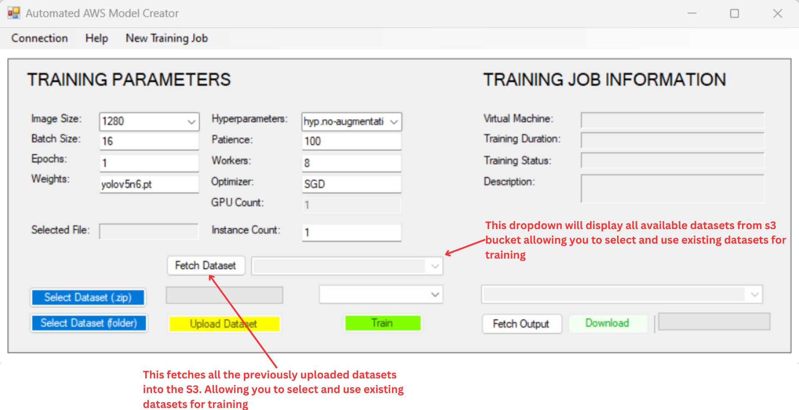

5. **Training**

   A dropdown is available for users to select specific instances to be used in training their model. Different instances vary in specifications therefore they differ in performance. Clicking the Train button will initiate a training job utilizing the training parameters inputted. Currently, there are only 5 instance available for use in initiating a training job, namely: *ml.m5.large, ml.m5.xlarge, ml.g4dn,xlarge, ml.g4dn.12xlarge, ml.p3.16xlarge.*

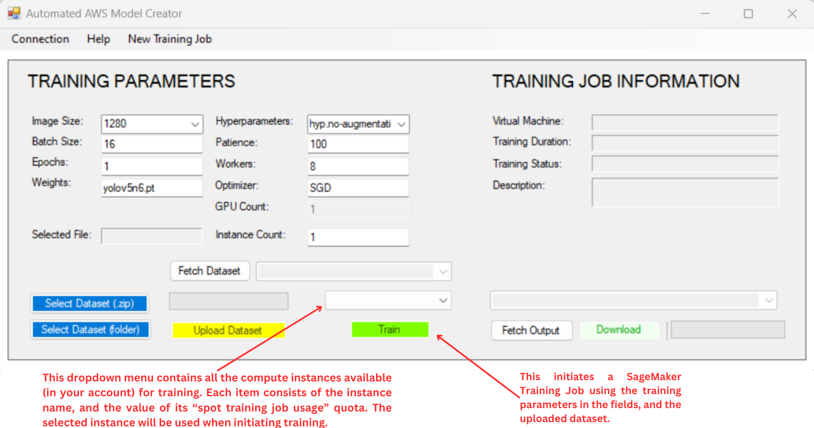

6. **Simultaneous Training**

   Users can perform multiple training jobs at the same time, depending on the number of service quota of the training instance selected. Clicking the New Training Job button in the navigation menu of the application will open a new window that will let the user perform another training job with the same user details that was entered when logging in.

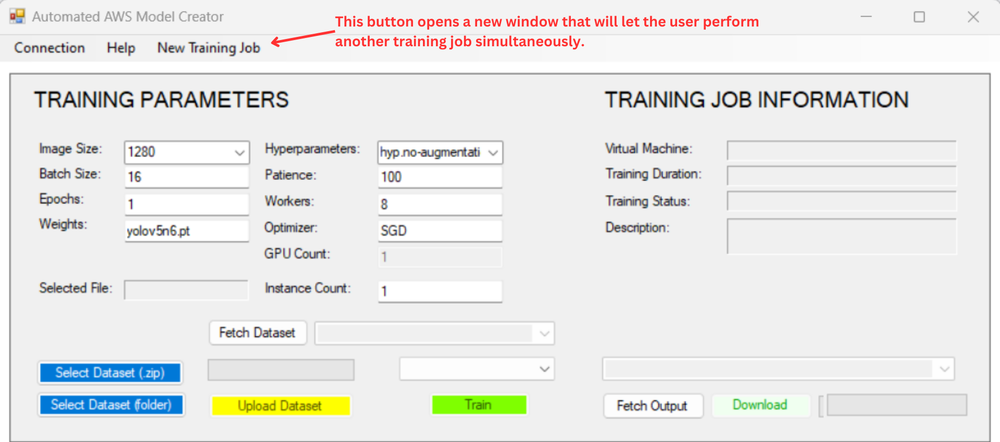

7. **Logging**

   After initiating a training job by clicking the ‘Train’ button, the information of the current training job which includes:

   1. Computing Instance (virtual machine) used.
   1. Training duration.
   1. Training status.
   1. Description.

   These details will be displayed and the application window will be extended at the bottom which will be used in displaying the logs of the training job in real time. You may also go to CloudWatch in the AWS Console Management and locate for **/aws/sagemaker/TrainingJobs** in the Log groups section. Afterwards, look for the latest Log stream that you have associated the training job with.

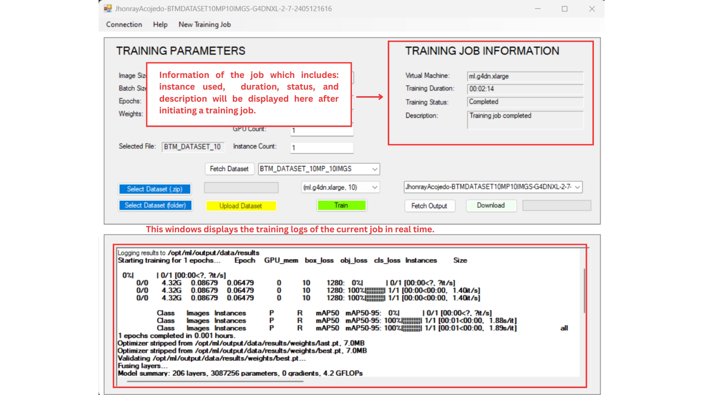

8. **Fetch and Download Output**

   Users have the ability to download training job results. There are two (2) approaches how users can perform the download feature:

   1. Click the Fetch Output button which will fetch all the available output folder for the ‘training-jobs’ directory in the S3 bucket. The results will be stored in the dropdown that will let the user select specific training job results and clicking the Download button will download the selected item from the dropdown. Users can achieve this even without performing a training job.
   1. Users can perform the training job by configuring the parameters, either uploading a custom dataset or utilizing the default one, selecting the preferred training instance, and then clicking the ‘Train’ button to start the training. After the current training job is done, users can directly click the Download button, without clicking the Fetch Output button, and it will directly download the results of the latest training job performed.

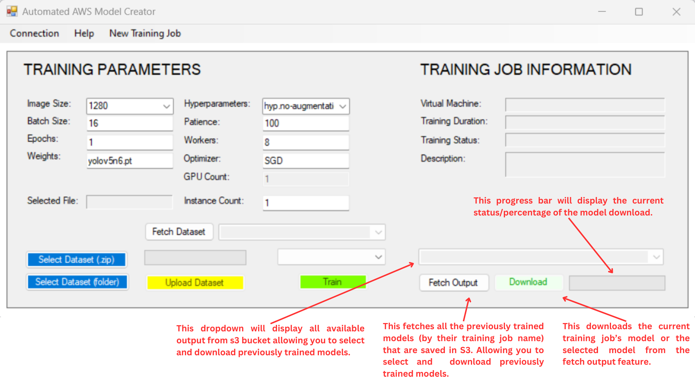

# **Application Patch Notes**

- Add a README.md and align it for the Help feature in the application (5/16/2024).
- Remove unused unit tests and update dotnet.yml according to recent project renaming (5/16/2024).
- Refactor and rename the entire development solution project pushed to GitHub repository (5/16/2024).
- Update dataset configuration in docker where it accepts generic datasets (5/16/2024).
- Handled docker enhancement in terms of YOLOv5 training potential errors in displaying the failure reason of the training job to the client (5/15/2024).
- Added validation for multi-instance when users select non-GPU instances (5/15/2024).
- Handled every training job failure to show an error message box to improve user experience (514/2024).
- Set volume size to 50GB as minimum and 48 hours as maximum running and waiting time for all training jobs (5/14/2024).
- Fixed outdated output date naming where it failed to sort according to date (5/13/2024).
- Set GPU Count value to be read only and allow only specific instances for users (5/13/2024).
- Fixed a bug where fetching empty datasets will concatenate the error message (5/13/2024).
- Minor revisions in enabling/disabling of buttons that do not align with their individual use cases to avoid potential errors (5/13/2024).
- Implemented in-line documentation of the source code to guide future developers that will make changes to the code (5/12/2024).
- Minor revisions in proper filtering of download outputs of specific users and implement progress tracker for download use case (5/11/2024).
- Fixed a bug in the upload dataset use case where multiple uploads are shared instead of simultaneous (5/11/2024).
- Implemented a new feature that specifies a directory for specific IAM Users according to their UserNames which stores their custom uploads and training jobs when using the application (5/10/2024).
- Minor revisions in attempt to fix concurring threading issues and errors in simultaneous upload/training/download use cases in the application (5/7/2024).
- Implemented a Docker enhancement that builds the yolo5-training image to Mitsumi’s ECR wherein it aligns with the Mitsumi’s software in producing the dataset’s folder structure (5/5/2024).
- Implemented a different approach in tracking the training job using the CloudWatch’s LiveTail service (5/2/2024).
- Implemented a new feature that fetches the list of datasets that was previously uploaded and disables auto dataset deletion in the S3 bucket (4/26/2024).
- Implemented an auto batch size calculation that depends on the number of GPUs and number of instances entered (4/25/2024).
- Added partial build tests for the Windows Form Application in .NET 4.8 (04/23/2024).
- Added partial unit testing for the Python and shell scripts that are necessary for the YOLOv5 model image (04/21/2024).
- Application is now currently using Mitsumi’s AWS account ECR repository that contains the YOLOv5 model image (04/15/2024).
- Multi-Instance Single/Multiple GPU DDP training is now capable in the training image and is being used by the application (04/14/2024).
- Application is not yet capable of Multi-Instance Single/Multiple GPU DDP training due to some limitations in Amazon SageMaker automated network management (04/05/2024).
- Application is currently using the developers’ ECR repository of the YOLOv5 model image even if the Mitsumi account does not have any ECR repository (04/05/2024).
- Multi-GPU Distributed Data Parallel (DDP) training but is only applicable to computing instances that have multiple GPUS, therefore, Mitsumi users cannot utilize this yet until instances like “ml.g4dn.12xlarge”, “ml.p3.8xlarge”, or other instances that have more than one (1) GPUS have an increased service quota value (03/04/2024).
